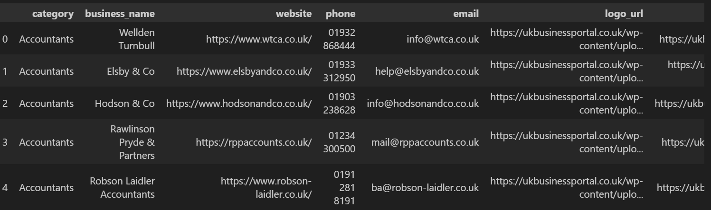
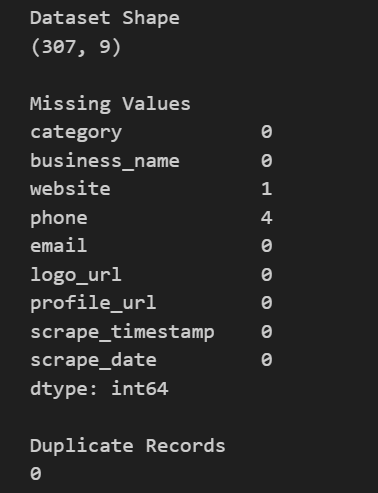
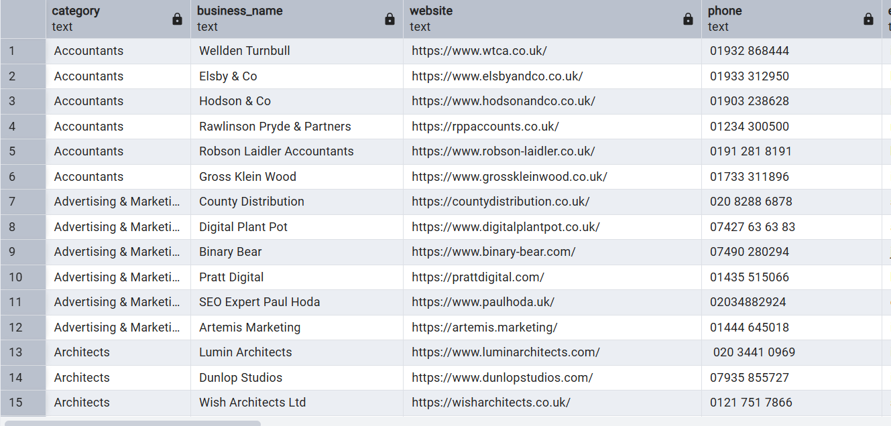

# UK Business Portal Data Pipeline

## Overview

This project demonstrates the development of an end-to-end data pipeline that collects business directory information from the UK Business Portal website using Python.

The pipeline automates the extraction of publicly available business information across multiple business categories, performs data quality validation, and stores the resulting dataset in PostgreSQL for analysis.

The project was built to showcase practical skills in:

* Web Scraping
* Data Collection
* Data Cleaning
* Data Validation
* ETL Development
* PostgreSQL Integration
* SQL Analytics

---

## Business Problem

Business directories contain valuable information that can support:

* Lead generation
* Sales prospecting
* Market research
* Business intelligence
* Contact database creation

Manually collecting this information is time-consuming and inefficient.

This project automates the extraction of business information and transforms it into a structured dataset suitable for analysis and reporting.

---

## Technologies Used

| Technology       | Purpose                         |
| ---------------- | ------------------------------- |
| Python           | Data Pipeline Development       |
| Selenium         | Dynamic Website Automation      |
| BeautifulSoup    | HTML Parsing                    |
| Pandas           | Data Cleaning & Transformation  |
| PostgreSQL       | Data Storage                    |
| SQLAlchemy       | Database Integration            |
| Python-dotenv    | Environment Variable Management |
| Jupyter Notebook | Development Environment         |
| Git & GitHub     | Version Control                 |

---

## Data Collected

The scraper extracts the following information:

| Column           | Description           |
| ---------------- | --------------------- |
| category         | Business Category     |
| business_name    | Business Name         |
| website          | Company Website       |
| phone            | Contact Number        |
| email            | Contact Email         |
| logo_url         | Business Logo URL     |
| profile_url      | Business Profile URL  |
| scrape_timestamp | Timestamp of Scraping |
| scrape_date      | Scrape Date           |

---

## Project Workflow

```text
UK Business Portal
        │
        ▼
    Selenium
        │
        ▼
  BeautifulSoup
        │
        ▼
 Data Extraction
        │
        ▼
    Pandas
        │
        ▼
Data Validation
        │
        ▼
 PostgreSQL
        │
        ▼
 SQL Analysis
```

---

## Project Features

### Dynamic Category Discovery

The scraper automatically discovers business categories from the website instead of relying on hardcoded URLs.

### Automated Data Collection

Business listings are extracted across all available categories using Selenium and BeautifulSoup.

### Data Quality Validation

The pipeline performs validation checks to identify:

* Missing values
* Duplicate records
* Contact information completeness

### PostgreSQL Integration

The cleaned dataset can be loaded directly into PostgreSQL for querying and analysis.

---

## Dataset Summary

| Metric                   | Value    |
| ------------------------ | -------- |
| Total Businesses Scraped | 303      |
| Total Columns            | 9        |
| Duplicate Records        | 0        |
| Missing Websites         | 1        |
| Missing Phone Numbers    | 3        |
| Missing Emails           | 0        |
| Data Completeness        | Over 99% |

---

## Project Structure

```text
uk-business-portal-data-pipeline/
│
├── data/
│   └── uk_business_portal.csv
│
├── notebooks/
│   └── uk_business_scraper.ipynb
│
├── sql/
│   └── client_queries.sql
│
│
├── .env
├── requirements.txt
└── README.md
```

---

## Screenshots

### Source Business Listings

The scraper extracts business information including company names, websites, phone numbers, email addresses, logos, and profile links.


### Category Discovery

The scraper automatically identifies and stores available business categories.


### Category DataFrame

Categories are transformed into a structured Pandas DataFrame before processing.


### Master Dataset

The final dataset combines all extracted business records into a single DataFrame.



### Data Quality Validation

Automated checks are performed to identify missing values and duplicate records.



### PostgreSQL Integration

The cleaned dataset is loaded into PostgreSQL for storage and querying.



### SQL Analysis

Business-focused SQL queries are used to generate insights from the dataset.


---

## Installation

### 1. Clone the Repository

```bash
git clone https://github.com/Chukwuemeka971/uk-business-portal-data-pipeline.git

cd uk-business-portal-data-pipeline
```

### 2. Create a Virtual Environment

This project was developed using a dedicated Python virtual environment created from Anaconda Prompt.

```bash
python -m venv uk_business_env
```

Activate the environment:

#### Windows

```bash
uk_business_env\Scripts\activate
```

#### Mac/Linux

```bash
source uk_business_env/bin/activate
```

### 3. Install Required Libraries

```bash
pip install -r requirements.txt
```

### 4. Configure Environment Variables

Create a `.env` file in the project root:

```env
POSTGRES_USER=postgres
POSTGRES_PASSWORD=your_password
POSTGRES_HOST=localhost
POSTGRES_PORT=5432
POSTGRES_DB=uk_business
```

---

## Running the Project

### Step 1: Launch Jupyter Notebook

```bash
jupyter notebook
```

### Step 2: Open the Notebook

```text
notebooks/uk_business_scraper.ipynb
```

### Step 3: Run All Cells

The pipeline will:

1. Connect to the source website
2. Discover available categories
3. Extract business listings
4. Perform data quality validation
5. Create the final dataset
6. Export data to CSV
7. Load data into PostgreSQL

---

## Exported Dataset

The final dataset is exported as:

```text
data/uk_business_portal.csv
```

---

## PostgreSQL Integration

The cleaned dataset is loaded directly into PostgreSQL using Pandas and SQLAlchemy.

```python
master_df.to_sql(
    "businesses",
    engine,
    if_exists="replace",
    index=False
)
```

---

## Example SQL Analysis

### Businesses by Category

```sql
SELECT
    category,
    COUNT(*) AS business_count
FROM businesses
GROUP BY category
ORDER BY business_count DESC;
```

### Businesses with Complete Contact Information

```sql
SELECT
    business_name,
    website,
    phone,
    email
FROM businesses
WHERE website IS NOT NULL
  AND phone IS NOT NULL
  AND email IS NOT NULL;
```

Additional SQL queries are available in:

```text
sql/client_queries.sql
```

---

## Skills Demonstrated

* Web Scraping
* Selenium Automation
* BeautifulSoup
* Data Cleaning
* Data Validation
* ETL Development
* PostgreSQL
* SQL Querying
* Environment Management
* Data Engineering Fundamentals

---

## Future Improvements

* Scrape individual business profile pages
* Implement incremental data loading
* Add logging and monitoring
* Schedule automated scraping jobs
* Build a Power BI dashboard
* Containerize using Docker
* Orchestrate workflows using Apache Airflow

---

## Author

### Chukwuemeka Nwankwo

Data Analyst | Aspiring Data Engineer

This project was developed as part of my data engineering portfolio to demonstrate practical experience in web scraping, ETL development, data quality validation, PostgreSQL integration, and SQL analytics.
